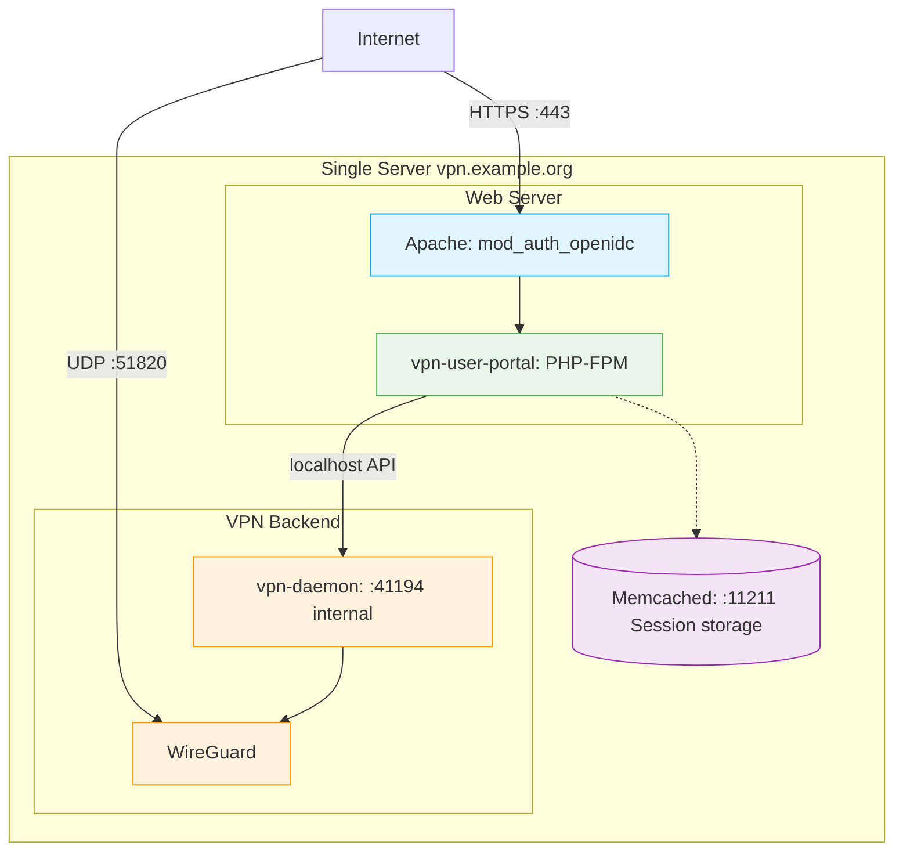

# eduVPN – Single-Server All-in-One Deployment

[](https://www.gnu.org/licenses/gpl-3.0)


**🚀 Automate your VPN deployment in minutes!**
A powerful, production-ready Ansible playbook for deploying **eduVPN v3** on a single Debian or Ubuntu server.

> [!WARNING]
> **Disclaimer**
>
> Consortium GARR provides this code as-is to the community for sharing purposes but does not guarantee support, maintenance, or further development of the code. Use it at your own discretion.

This repository contains an **Ansible playbook** for automated deployment of **eduVPN v3** on a **single Debian/Ubuntu server**, with the user portal (frontend) and VPN node (backend) co-located on the same host.

## ✨ Key Features

- ⚡ **Fully automated deployment** with a single command
- 📝 **Configuration files ready** with placeholder values to replace
- 🔒 **WireGuard and OpenVPN** support out-of-the-box
- 📜 **Automatic Let's Encrypt** certificates
- 🔐 **LDAP, OIDC/SAML or local database** authentication
- 🛡️ **Automatically configured iptables** firewall
- 🏢 **Production-ready** defaults

**Official Reference**: [eduVPN Deployment Guide](https://docs.eduvpn.org/server/v3/deploy-debian.html)

## 📑 Table of Contents

- [✨ Key Features](#-key-features)
- [🏛️ Architecture](#%EF%B8%8F-architecture)
- [📋 Requirements](#-requirements)
- [🚀 Quick Start](#-quick-start)
- [🛠️ Detailed Installation Guide](#%EF%B8%8F-detailed-installation-guide)
- [📖 Variables Reference](#-variables-reference)
- [🔧 Maintenance Operations](#-maintenance-operations)
- [🐛 Troubleshooting](#-troubleshooting)
- [📚 Useful Resources](#-useful-resources)

## 🏛️ Architecture



### Components

- **vpn-user-portal**: Web interface for users, profile and configuration management
- **vpn-server-node**: VPN backend with WireGuard and OpenVPN support
- **vpn-daemon**: Internal API for VPN connection management
- **Apache + PHP-FPM**: Web server with HTTPS support and mod_auth_openidc
- **Memcached**: User session storage
- **iptables**: Firewall with NAT/masquerade rules for VPN traffic

## 📋 Requirements

### Target Server

| Item | Requirements |
|----------|-------------|
| **Operating System** | Debian or Ubuntu|
| **System State** | Clean installation with all updates applied |
| **IP Address** | Static public IPv4 (IPv6 optional) |
| **Hostname** | Properly configured FQDN (e.g., `vpn.example.org`) |
| **DNS** | `A` record (and optional `AAAA`) pointing to the server |
| **Firewall** | Open ports: TCP 22, 80, 443 and UDP 51820 |
| **Access** | SSH with sudo privileges |

### Control Machine (where you run Ansible)

| Item | Requirements |
|----------|-------------|
| **Python** | 3.8+ |
| **Ansible** | ≥ 8.0 (installed via `pip`) |
| **Connectivity** | SSH access to target server |

### Network Ports

| Port | Protocol | Service | Notes |
|-------|----------|---------|-------|
| 22    | TCP      | SSH     | Administration |
| 80    | TCP      | HTTP    | HTTPS redirect + ACME challenge |
| 443   | TCP      | HTTPS   | vpn-user-portal web portal |
| 51820 | UDP      | WireGuard| VPN tunnel (can be modified) |
| 1194  | UDP/TCP  | OpenVPN  | VPN tunnel (optional) |

## 🚀 Quick Start

### Initial Setup (first time only)

1. **Edit configuration files**:
   ```bash
   cd ansible/
   # Files already contain placeholder values to replace
   nano group_vars/all/vars.yml          # Configure domain, IP, email, etc.
   nano inventories/single/hosts.ini     # Configure target server
   nano group_vars/all/vault.yml         # Generate and insert secrets
   ```

2. **Generate your secrets**:
   ```bash
   # Node key
   openssl rand -hex 32
   
   # WireGuard keys
   wg genkey | tee /tmp/wg.key | wg pubkey
   
   # OIDC secrets (if needed)
   pwgen -s 32 1
   ```
   Insert generated values into `vault.yml`

3. **Encrypt the vault**:
   ```bash
   ansible-vault encrypt group_vars/all/vault.yml
   ```

4. **Run the deployment**:
   ```bash
   ansible-playbook playbook.yml --ask-vault-pass
   ```

---

## 🛠️ Detailed Installation Guide

### Step 1: Control Machine Preparation

Install Ansible dependencies on your local machine (not on the VPN server):

```bash
cd ansible/
pip install -r requirements.txt
ansible-galaxy collection install -r requirements.yml
```

**Dependencies installed:**
- `ansible-core` ≥ 8.0
- Collection `ansible.posix` (for sysctl, firewall management)
- Collection `community.general` (for Apache modules)

### Step 2: Inventory Configuration

Edit the inventory file to specify the target server:

```bash
nano inventories/single/hosts.ini
```

**Example:**
```ini
[single]
vpn.example.org ansible_user=ubuntu ansible_ssh_private_key_file=~/.ssh/id_rsa
```

### Step 3: Variables Configuration

Edit deployment variables:

```bash
nano group_vars/all/vars.yml
```

**Main variables to modify:**

| Variable | Description | Example |
|----------|-------------|---------|
| `eduvpn_fqdn` | VPN server FQDN | `vpn.example.org` |
| `server_ipv4` | Public IPv4 address | `90.123.123.123` |
| `debian_code_name` | Debian/Ubuntu codename | `bookworm` or `noble` |
| `public_interface_name` | Public network interface | `ens3`, `eth0` |
| `certbot_admin_email` | Email for Let's Encrypt | `admin@example.org` |
| `auth_module` | Authentication method | `DbAuthModule`, `OidcAuthModule`, `LdapAuthModule` |

#### Authentication Configuration

**Option 1: Local Database (DbAuthModule)**
```yaml
auth_module: DbAuthModule
```
- Authentication based on local username/password
- Ideal for small deployments or testing

**Option 2: OpenID Connect (OidcAuthModule)**
```yaml
auth_module: OidcAuthModule
oidc_provider_metadata_url: "https://sso.example.org/.well-known/openid-configuration"
oidc_client_id: "eduvpn-client"
oidc_redirect_uri: "https://{{ eduvpn_fqdn }}/vpn-user-portal/redirect_uri"
```
- Integration with SSO providers (Keycloak, Auth0, Google, etc.)
- Requires client configuration on OIDC provider

**Option 3: LDAP (LdapAuthModule)**
```yaml
auth_module: LdapAuthModule
ldap_uri: "ldap://ldap.example.org"
ldap_bind_dn_template: "uid={{UID}},ou=people,dc=example,dc=org"
```
- Authentication against LDAP/Active Directory

#### VPN Profiles Configuration

Edit the `profiles` section to define VPN profiles:

```yaml
profiles:
  - id: default
    name: "Default VPN"
    hostname:
      - "{{ eduvpn_fqdn }}"
    default_gateway: false              # true = all traffic goes through VPN
    dnsServerList: 
      - "9.9.9.9"                       # Public or internal DNS
      - "149.112.112.112"
    routelist:                          # Only these networks go through VPN
      - "192.168.0.0/16"
      - "10.0.0.0/8"
    preferred_proto: wg                 # wg = WireGuard, openvpn = OpenVPN
    wg_range_ipv4:
      "0": "10.43.43.0/24"              # Internal IP range for VPN clients
```

### Step 4: Secrets Configuration (Vault)

The `group_vars/all/vault.yml` file contains placeholders for all secrets. 

**IMPORTANT**: Generate and insert your own values before deployment:

#### A) Generate Internal CA Certificates

The `vault_ca_crt` and `vault_ca_key` certificates are used for internal mTLS communication between the portal and vpn-daemon. 

Generate new certificates

```bash
# Generate CA key
openssl ecparam -name prime256v1 -genkey -noout -out ca.key

# Generate CA certificate
openssl req -new -x509 -key ca.key -out ca.crt -days 3650 \
  -subj "/CN=vpn-daemon CA"

# Generate certificate for vpn-daemon
openssl ecparam -name prime256v1 -genkey -noout -out tls.key
openssl req -new -key tls.key -out tls.csr -subj "/CN=vpn-daemon"
openssl x509 -req -in tls.csr -CA ca.crt -CAkey ca.key 
```
> **Note**: For single-server deployments, `vpn_daemon_use_tls: false` is the recommended setting (communication happens on localhost).

#### B) Edit and Encrypt the Vault

```bash
# Edit the vault with generated values
nano group_vars/all/vault.yml

# Encrypt the file with ansible-vault
ansible-vault encrypt group_vars/all/vault.yml
```

You'll be prompted for a password that you must remember for future deployments.

> **Important**: The `oauth.key` is automatically generated by the playbook via `/usr/libexec/vpn-user-portal/generate-secrets` and should NOT be manually inserted.

### Step 5: TLS Certificate (Let's Encrypt)

The playbook **fully automates** obtaining the Let's Encrypt certificate using **certbot standalone**.

**Requirements:**
- TCP port 80 must be reachable from the Internet during first deployment
- DNS must correctly point to the server
- The `certbot_admin_email` parameter must be configured in `vars.yml`

**Configuration in vars.yml:**
```yaml
certbot_create_if_missing: true
certbot_create_method: standalone
certbot_testmode: false                    # true for test certificates
certbot_admin_email: admin@example.org
```

The playbook:
1. Checks if certificate already exists
2. Temporarily stops Apache
3. Runs `certbot` in standalone mode
4. Obtains Let's Encrypt certificate
5. Restart Apache with new certificate

**Automatic renewal**: Let's Encrypt automatically configures renewal via systemd timer.

### Step 6: Running the Playbook

Run the complete deployment:

```bash
ansible-playbook playbook.yml --ask-vault-pass
```

**Expected output:**
- Installation of eduVPN packages from official repository
- Configuration of Apache, PHP-FPM, Memcached
- Deployment of portal and node configurations
- Generation and distribution of cryptographic keys
- Obtaining Let's Encrypt certificate
- Firewall configuration (iptables)
- Service activation (apache2, vpn-daemon, memcached)

### Step 7: Post-Installation Verification

#### A) Verify Active Services

```bash
ssh root@vpn.example.org

# Check service status
systemctl status apache2
systemctl status vpn-daemon
systemctl status memcached

# Verify certificate
certbot certificates

# Verify WireGuard interfaces
wg show
```

#### B) Create First Admin User (DbAuthModule)

If using `DbAuthModule`, create an administrator user:

```bash
ssh root@vpn.example.org
sudo -u www-data vpn-user-portal-account --add admin
# Enter password when prompted
```

Configure the user as admin in `/etc/vpn-user-portal/config.php`:
```php
'adminUserIdList' => ['admin'],
```

Apply changes:
```bash
vpn-maint-apply-changes
```

#### C) Access Web Portal

Open browser and go to:
```
https://vpn.example.org/vpn-user-portal/
```

-  You should see the eduVPN login page
-  HTTPS certificate should be valid (Let's Encrypt)
-  Login with the created user or via SSO (if OIDC configured)

### Step 8: Subsequent Deployments

To update only configurations (without reinstalling packages):

```bash
ansible-playbook playbook.yml --ask-vault-pass --tags update_config
```

To update only firewall rules:

```bash
ansible-playbook playbook.yml --ask-vault-pass --tags iptables
```

To redistribute WireGuard keys:

```bash
ansible-playbook playbook.yml --ask-vault-pass --tags wg
```

---

## 📖 Variables Reference

### General Variables (`group_vars/all/vars.yml`)

| Variable | Default | Description |
|----------|---------|-------------|
| `eduvpn_fqdn` | `vpn.example.org` | VPN portal FQDN (must match DNS) |
| `debian_code_name` | `bookworm` | Distribution codename (bookworm, noble) |
| `public_interface_name` | `eth0` | Public network interface for masquerading |
| `server_ipv4` | – | Server's public IPv4 address |
| `server_ipv6` | `""` | Server's public IPv6 address (empty to disable) |
| `wireguard_port` | `51820` | WireGuard listening port |
| `node_slave_port` | `41194` | vpn-daemon internal API port (localhost) |
| `vpn_daemon_use_tls` | `false` | Enable mTLS between portal and vpn-daemon (not recommended for single-host) |

### Authentication

| Variable | Description |
|----------|-------------|
| `auth_module` | Authentication module: `DbAuthModule`, `OidcAuthModule`, `LdapAuthModule` |
| `oidc_provider_metadata_url` | OpenID Connect provider metadata URL |
| `oidc_client_id` | Client ID registered on OIDC provider |
| `oidc_redirect_uri` | Redirect URI after OIDC authentication |
| `ldap_uri` | LDAP server URI (e.g., `ldap://ldap.example.org`) |
| `ldap_bind_dn_template` | LDAP bind DN template (e.g., `uid={{UID}},ou=people,dc=example,dc=org`) |
| `admin_user_id_list` | List of administrator users |

### VPN Profiles

Profiles are defined in the `profiles` list, each with:

| Parameter | Description |
|-----------|-------------|
| `id` | Unique profile identifier |
| `name` | Display name of the profile |
| `hostname` | List of VPN server hostnames |
| `default_gateway` | `true` = all traffic goes through VPN, `false` = split tunneling |
| `dnsServerList` | List of DNS servers for clients |
| `dnsSearchDomainList` | List of DNS search domains |
| `routelist` | IPv4 networks to route through VPN |
| `routelist_ipv6` | IPv6 networks to route through VPN |
| `preferred_proto` | Preferred protocol: `wg` (WireGuard) or `openvpn` |
| `wg_range_ipv4` | Internal IP range for WireGuard clients |
| `wg_range_ipv6` | Internal IPv6 range for WireGuard clients |
| `oUdpPortList` | UDP ports for OpenVPN |
| `oTcpPortList` | TCP ports for OpenVPN |

### Certificates (Let's Encrypt)

| Variable | Default | Description |
|----------|---------|-------------|
| `certbot_create_if_missing` | `true` | Automatically obtain certificate |
| `certbot_create_method` | `standalone` | Certbot method (standalone/webroot) |
| `certbot_testmode` | `false` | Use Let's Encrypt staging server |
| `certbot_admin_email` | – | Email for Let's Encrypt notifications |

### Secrets (`group_vars/all/vault.yml` - encrypted)

| Variable | Generation | Description |
|----------|------------|-------------|
| `vault_node_key` | `openssl rand -hex 32` | Shared key portal↔node (32 hex characters) |
| `vault_wireguard_private_key` | `wg genkey` | WireGuard private key |
| `vault_wireguard_public_key` | `wg pubkey` | WireGuard public key |
| `vault_oidc_clients_secret` | OIDC client secret | OIDC client secret |
| `vault_oidc_crypto_passphrase` | `pwgen -s 32 1` | OIDC encryption passphrase |
| `vault_ca_crt` | PEM certificate | Internal CA for vpn-daemon mTLS |
| `vault_ca_key` | PEM private key | Internal CA private key |
| `vault_tls_crt` | PEM certificate | vpn-daemon TLS certificate |
| `vault_tls_key` | PEM private key | vpn-daemon TLS private key |

---

## Useful Ansible Tags

| Tag | Effect | Command |
|-----|--------|---------|
| `update_config` | Redeploy only PHP configuration files | `ansible-playbook playbook.yml --tags update_config` |
| `iptables` | Reapply only firewall rules | `ansible-playbook playbook.yml --tags iptables` |
| `wg` | Redistribute WireGuard keys | `ansible-playbook playbook.yml --tags wg` |

---

## 🔧 Maintenance Operations

### User Management (DbAuthModule)

**Add new user:**
```bash
sudo -u www-data vpn-user-portal-account --add username
```

**Modify existing user password:**
```bash
sudo -u www-data vpn-user-portal-account --add username  # overwrites
```

**Configure administrator:**
Edit `/etc/vpn-user-portal/config.php`:
```php
'adminUserIdList' => ['admin', 'username'],
```

Apply changes:
```bash
vpn-maint-apply-changes
```

### System Updates

The playbook installs an automatic update script in `/etc/cron.weekly/vpn-maint-update-system`.

**Manual update:**
```bash
# Update system packages
apt update && apt upgrade -y

# Update eduVPN packages
apt update && apt install --only-upgrade vpn-user-portal vpn-server-node vpn-maint-scripts

# Apply configuration changes
vpn-maint-apply-changes
```

See [Install Updates](https://docs.eduvpn.org/server/v3/install-updates.html) for more details.

### Modify VPN Profile Configuration

1. Edit `group_vars/all/vars.yml` (section `profiles`)
2. Run playbook with `update_config` tag:
   ```bash
   ansible-playbook playbook.yml --ask-vault-pass --tags update_config
   ```

Complete documentation: [Profile Config](https://docs.eduvpn.org/server/v3/profile-config.html)

### Monitoring

**Check service status:**
```bash
systemctl status apache2
systemctl status vpn-daemon
systemctl status memcached
```

**Useful logs:**
```bash
# Apache logs
tail -f /var/log/apache2/error.log

# vpn-daemon logs
journalctl -u vpn-daemon -f

# User portal logs
tail -f /var/log/vpn-user-portal.log

# Active WireGuard connections
wg show
```

**Usage statistics:**
```bash
# Show connected users and traffic
vpn-user-portal-show-stats
```

---

## 🐛 Troubleshooting

### Issue: Let's Encrypt certificate not obtained

**Error:** `Failed to obtain certificate from Let's Encrypt`

**Common causes:**
- TCP port 80 blocked by cloud/router firewall
- DNS not correctly pointing to server
- Hostname not properly configured

**Solution:**
```bash
# Verify DNS
dig +short vpn.example.org

# Verify port 80 reachability
nmap -p 80 vpn.example.org

# Verify hostname
hostnamectl

# Obtain certificate manually
certbot certonly --standalone -d vpn.example.org --email admin@example.org

# Re-run playbook
ansible-playbook playbook.yml --ask-vault-pass
```

### Issue: VPN connection fails

**Symptoms:** Client downloads configuration but does not connect

**Verify:**
```bash
# 1. Verify WireGuard port is open
ss -ulnp | grep 51820

# 2. Verify WireGuard interface
wg show

# 3. Verify IP forwarding
sysctl net.ipv4.ip_forward  # must be 1
sysctl net.ipv6.conf.all.forwarding  # must be 1

# 4. Verify iptables rules
iptables -t nat -L -n -v | grep MASQUERADE
```

**Solution:**
```bash
# Reapply firewall rules
ansible-playbook playbook.yml --ask-vault-pass --tags iptables

# Restart vpn-daemon
systemctl restart vpn-daemon
```

### Issue: OIDC authentication error

**Error:** `Unable to authenticate with OIDC provider`

**Verify:**
```bash
# Test provider metadata reachability
curl https://sso.example.org/.well-known/openid-configuration

# Verify portal configuration
cat /etc/vpn-user-portal/config.php | grep -A 10 OidcAuth
```

**Verify on OIDC provider:**
- Correct Client ID
- Redirect URI configured: `https://vpn.example.org/vpn-user-portal/redirect_uri`
- Correct client secret

### Issue: Apache does not start

**Error:** `apache2.service failed`

**Verify:**
```bash
# Test Apache configuration
apache2ctl configtest

# Verify certificates
ls -la /etc/letsencrypt/live/vpn.example.org/

# Apache logs
journalctl -u apache2 -n 50
```

**Common solution:**
```bash
# Regenerate certificate if missing
certbot certonly --standalone -d vpn.example.org

# Restart Apache
systemctl restart apache2
```

### Issue: vpn-daemon does not respond

**Symptoms:** Web portal works but does not create VPN connections

**Verify:**
```bash
# Service status
systemctl status vpn-daemon

# Detailed logs
journalctl -u vpn-daemon -n 100

# Verify keys
ls -la /etc/vpn-server-node/keys/

# Test internal connection
curl http://localhost:41194/api/stats
```

**Solution:**
```bash
# Redistribute node keys
ansible-playbook playbook.yml --ask-vault-pass --tags update_config

# Restart vpn-daemon
systemctl restart vpn-daemon

# Apply changes
vpn-maint-apply-changes
```

---

## 📁 Repository Structure

```
ansible/
├── ansible.cfg                         # Ansible configuration
├── playbook.yml                        # Main playbook (portal + node)
├── requirements.txt                    # Python dependencies
├── requirements.yml                    # Ansible collections
├── Makefile                            # Helper make (encrypt/decrypt vault)
├── encrypt.sh / decrypt.sh             # Vault management scripts
│
├── inventories/
│   └── single/
│       └── hosts.ini                   # Target server
│
├── group_vars/
│   └── all/
│       ├── vars.yml                    # Public variables
│       └── vault.yml                   # Secrets (encrypted)
│
├── files/
│   ├── credentials.conf               # Credentials template
│   └── vpn-daemon                     # Service script
│
└── templates/                          # Jinja2 templates
    ├── apache2/
    │   ├── apache_site-eduvpn.conf.j2           # Main VirtualHost
    │   └── apache_site-vpn-user-portal.conf.j2  # Portal API
    ├── eduvpn/
    │   ├── portal-config.php.j2                 # Portal configuration
    │   ├── node-config.php.j2                   # Node configuration
    │   └── vpn-daemon.env.j2                    # vpn-daemon environment
    ├── iptables/
    │   ├── iptables.j2                          # IPv4 firewall rules
    │   └── ip6tables.j2                         # IPv6 firewall rules
    ├── keys/
    │   ├── ca.crt.j2 / ca.key.j2               # Internal CA
    │   ├── oauth.key.j2                         # OAuth key
    │   └── tls.crt.j2 / tls.key.j2             # TLS daemon certificates
    └── memcached/
        └── memcached.conf.j2                    # Memcached config
```

---

## ⚙️ What the Playbook Does

### 1. System Packages Installation
- `apache2`, `php-fpm`, `memcached`
- `iptables-persistent`, `certbot`
- Tools: `curl`, `wget`, `pwgen`, `ipcalc-ng`, `wg`
- `libapache2-mod-auth-openidc` (for OIDC)

### 2. eduVPN Repository
- Downloads deploy scripts from [Codeberg eduVPN/deploy](https://codeberg.org/eduVPN/deploy)
- Adds eduVPN GPG key
- Configures apt repository `https://repo.eduvpn.org/v3/deb`

### 3. eduVPN Packages Installation
- `vpn-user-portal` (web frontend)
- `vpn-server-node` (VPN backend)
- `vpn-maint-scripts` (maintenance scripts)

### 4. eduVPN Configuration
- Deploy `/etc/vpn-user-portal/config.php` from template
- Deploy `/etc/vpn-server-node/config.php` from template
- Configure VPN profiles, auth module, admin users

### 5. Cryptographic Keys Distribution
- `node.0.key` → Shared key portal↔node
- `oauth.key` → Automatically generated by `vpn-user-portal`
- WireGuard keys → Private key on node, public key on portal
- CA/TLS certs → For vpn-daemon mTLS (if enabled)

### 6. TLS Certificate (Let's Encrypt)
- Temporarily stops Apache
- Runs `certbot standalone` for ACME challenge
- Obtains validated certificate
- Restarts Apache with configured HTTPS

### 7. Apache Configuration

- Deploy VirtualHost with TLS
- Enable modules: `ssl`, `headers`, `rewrite`, `proxy_fcgi`, `proxy_http`
- Configure php-fpm
- Disable default site

### 8. Networking Configuration
- Enable IPv4/IPv6 IP forwarding via sysctl
- Deploy iptables rules (NAT/MASQUERADE)
- Configure `iptables-persistent`

### 9. Services and Daemons
- Configure vpn-daemon environment
- Enable services: `apache2`, `vpn-daemon`, `memcached`
- Run `vpn-maint-apply-changes` to apply configurations

---

## 📚 Useful Resources

### Official eduVPN v3 Documentation

- [Deploy Debian/Ubuntu](https://docs.eduvpn.org/server/v3/deploy-debian.html)
- [Profile Configuration](https://docs.eduvpn.org/server/v3/profile-config.html)
- [Authentication - LDAP](https://docs.eduvpn.org/server/v3/ldap.html)
- [Authentication - SAML](https://docs.eduvpn.org/server/v3/saml.html)
- [Authentication - RADIUS](https://docs.eduvpn.org/server/v3/radius.html)
- [Permissions](https://docs.eduvpn.org/server/v3/permissions.html)
- [Firewall](https://docs.eduvpn.org/server/v3/firewall.html)
- [Portal Branding](https://docs.eduvpn.org/server/v3/branding.html)
- [Install Updates](https://docs.eduvpn.org/server/v3/install-updates.html)

### Repository

- [Codeberg eduVPN Deploy](https://codeberg.org/eduVPN/deploy)

---

## ⚖️ License

This project is licensed under the GNU General Public License v3.0. See the [LICENSE](LICENSE.md) file for details.

## 🤝 Contributing and Further Development

Contributions, further developments, error reports (and possibly fixes) are welcome.

For more info, please read the [CONTRIBUTING](CONTRIBUTING.md) file.

- [eduVPN Deploy Scripts](https://codeberg.org/eduVPN/deploy)
- [eduVPN Documentation](https://codeberg.org/eduVPN/documentation)

### Community
- [eduVPN Contact](https://www.eduvpn.org/contact/)
- [Client Apps](https://app.eduvpn.org/)

---